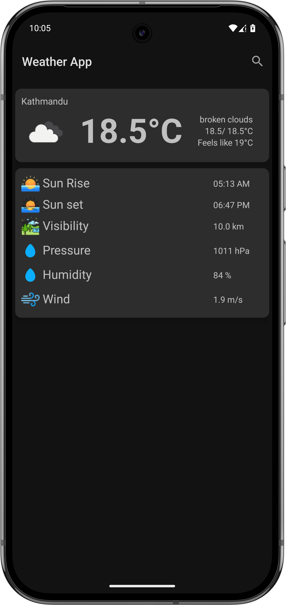
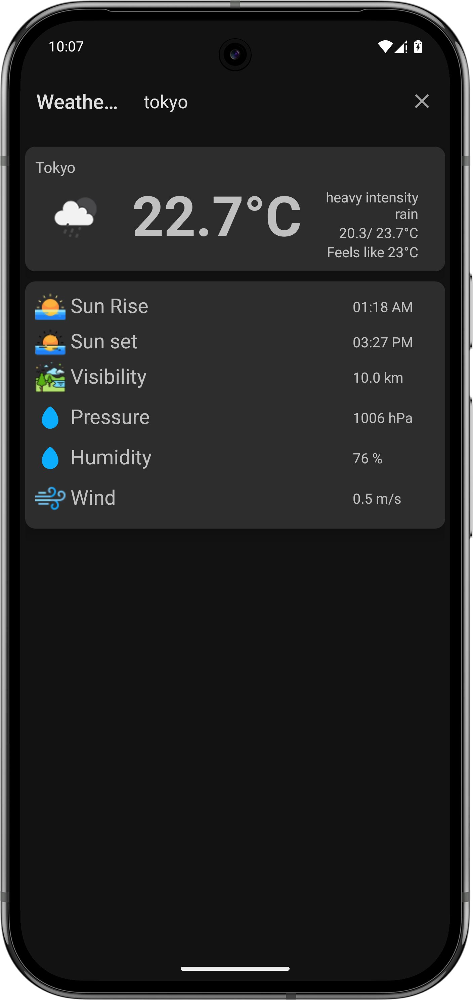

# 🌤️ Weather App

A simple Android weather application that fetches real-time weather data using the OpenWeatherMap API. Built using **Java**, **Volley**, and **SearchView**.

---

## 📱 Features

- 🔍 Search weather by city name
- 🌡️ Current temperature, feels like, high/low
- 🌥️ Weather description and icon
- 💨 Wind speed, 💧 humidity, 📈 pressure
- 👁️ Visibility, 🌅 sunrise and 🌇 sunset time
- ✨ Responsive UI and real-time updates

---

## 📸 Screenshots

<!-- Add your screenshots here -->
<p float="left">
  
  
</p>

---

## 🚀 Getting Started

### Prerequisites

- Android Studio (Arctic Fox or later)
- Android SDK 21+
- Internet connection

---

## 🔧 Installation

1. **Clone this repository:**
   ```bash
   git clone https://github.com/stharnav/Weather.git
   cd weather
   cd app/src/main/res/values/string.xml
2. **Put your Api key here**
   
